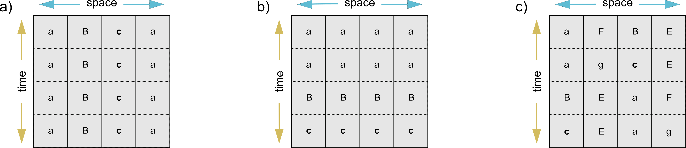
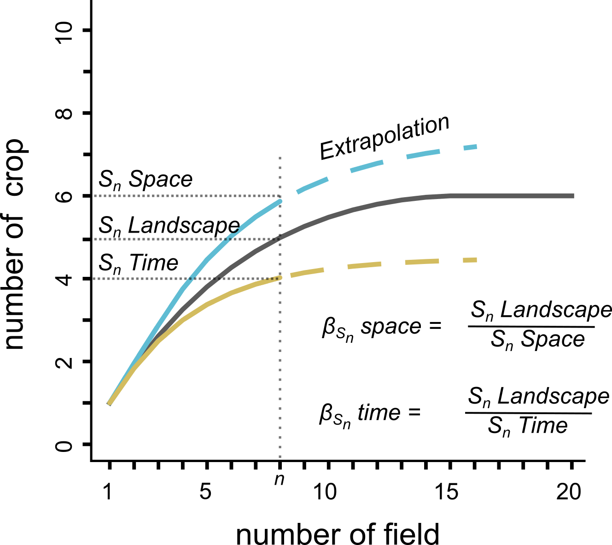
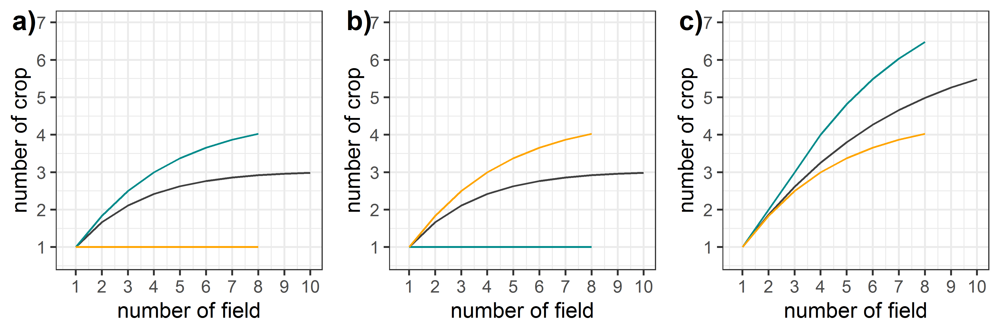
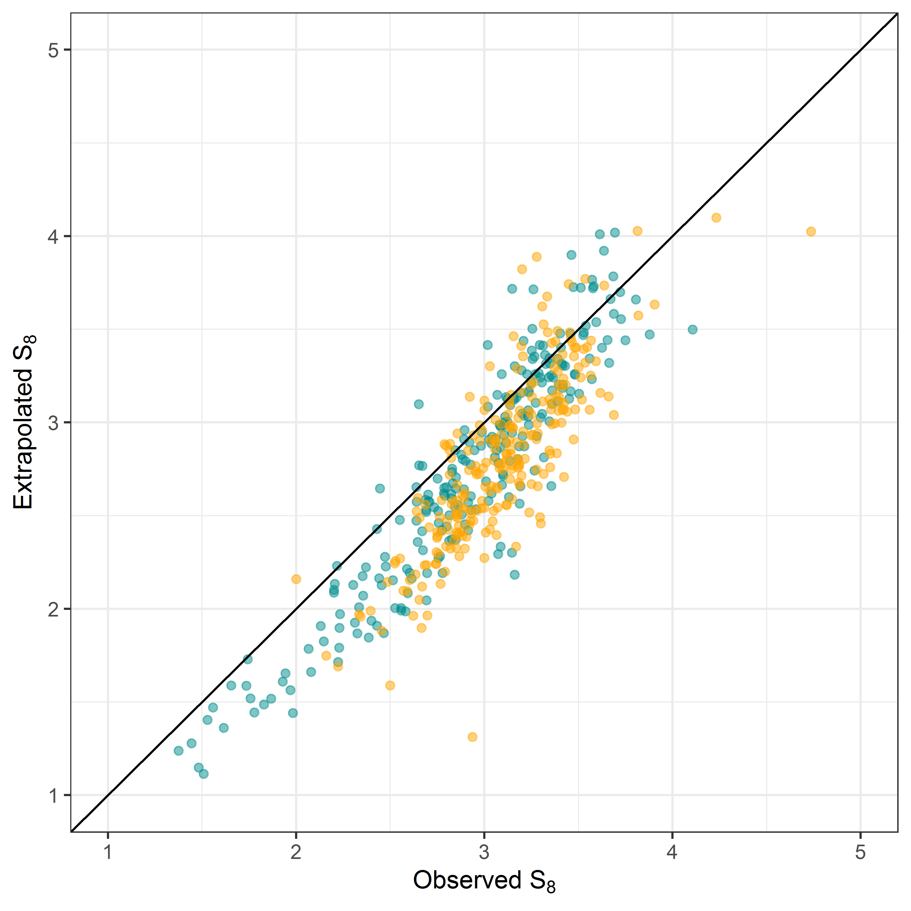

\vspace{0.25cm}
1. Biodiversity, UK Centre for Ecoloyg and Hydrology, Wallingford, OX10 8BB, UK.
2. Agroécologie, AgroSup Dijon, INRAE, Université de Bourgogne Franche-Comté, F-21000 Dijon, France.
3. Department of Food and Resource Economics, Copenhagen University, Rolighedsvej 23, DK-1958 Frederiksberg C., Denmark.
4. Université de Lorraine, INRAE, LAE, F-68000 Colmar, France.

\vspace{0.25cm}
\* Corresponding author, email: retoschm{at}ceh.ac.uk

\vspace{0.5cm}

```{r setup, include=FALSE}
knitr::opts_chunk$set(echo = TRUE)
```

## Introduction

When working at the landscape level, agroecologists typically focus on patterns and metrics that describe crop diversity and configuration in a single year (Wilson et al. 2017), treating them as static drivers of biodiversity and ecosystem services (e.g., Trichard et al. 2013, Fahrig et al. 2015, Marrec et al. 2017). The crop mosaic, however, is changing each year along the sequence of crops grown in rotation and in the longer-term through shifts associated with rotational intensification (e.g., Robinson and Sutherland 2002). The simplification of the landscape to a static layer overlooks the complexity of these dynamics that are a key feature of arable landscapes.

Crop rotations vary in space and time, with regions existing on a continuum from monocultures or simplified rotations with break crops (such as years of wheat followed by oil seed rape), to more diverse and longer rotations designed to meet particular agronomic goals (Barbieri et al. 2017). To date, the spatiotemporal organisation and the dynamics of arable crops in landscapes has largely been overlooked by agroecologists, and its description remains a significant methodological challenge (but see Rizzo et al. 2019).The analysis of spatiotemporal crop diversity patterns can highlight outlier landscapes that depart from any relationship between the temporal (rotational) and the spatial (landscape) component of crop diversity, revealing crop concentrations, high spatial synchrony or low temporal diversity

Here we present an analytical framework to calculate and analyze the spatial and temporal component of crop diversity in agricultural landscapes. Building on the concept individual-based rarefaction curve, we provide and explain the necessary R-script used to compute the different diversity metrics from crop sequences grown in arable landscapes. Each steps and the functions are illustrated with an example, using crop sequences extracted from 500 5x5km landscapes distributed across Denmark and France. 

## Spatiotemporal components of crop diversity in agricultural landscapes 

Agricultural landscapes are shaped by cropping systems that determine the diversity of crops sown in arable fields in a given year, but also by the crops sown in each field in previous years. These aspects of cropping systems can have important implication for pest dynamics, amount of available foraging resources as well as it distribution in space and time. Temporal variation in resources availability can have important impact on support capacity and the biodiversity found in production landscape.

To illustrate the spatial and temporal component of crop diversity, we can build three extreme cases of cropping system in a given landscape. First a landscape with monocultures, each field being allocated to a specific crop (Figure 1a). Second a landscape with the same rotation (crop sequence) sown across all field, resulting in homogeneous landscape in each given year (Figure 1b). Third a landscape with rotations that are not synchronized, generating crop heterogeneity in both space and time (Figure 1c). 



We can represent these landscapes in data.table with a column to identify the field (parcel_id), the year, and the crop (crop_name).
\vspace{0.5cm}

```{r landscapes_matrix}

library(data.table)

#case (a)
mono_div <- data.table(parcel_id = c(rep(c(1,2,3,4),c(4,4,4,4))),
            year = c(rep(c(1,2,3,4),c(4))),
            crop_name = c(rep(c("a", "a", "b", "c"),c(4,4,4,4))))

#case b)
rot_sync <- data.table(parcel_id = c(rep(c(1,2,3,4),c(4,4,4,4))),
            year = c(rep(c(1,2,3,4),c(4))),
            crop_name = c("a", "a", "b", "c",
                          "a", "a", "b", "c", 
                          "a", "a", "b", "c",
                          "a", "a", "b", "c"))

#case c)
div_rot_desync <- data.table(parcel_id = c(rep(c(1,2,3,4),c(4,4,4,4))),
            year = c(rep(c(1,2,3,4),c(4))),
            crop_name = c("a", "a", "B", "c",
                          "F", "g", "E", "E", 
                          "B", "c", "a", "a",
                          "E", "E", "F", "g"))
```

Crop diversity can be estimated along 1) the spatial dimension, representing the diversity of crop grown in a landscape in a given year, 2) the temporal dimension, representing the diversity of crop sown in a given field over multiple years, and 3) the overall diversity computed across time and space, representing crop diversity sown in a given landscape, over time and space. Each of these diversity indices can be derived from Individual-Based Rarefaction (IBR) curves where each sown crop event, i.e., field in a given year or a crops along the temporal crop sequence (rotation) in a given field. From these IBR curves, we can estimate and contrast the spatial and temporal components of crop diversity observed in a specific landscape (Figure 2).



## Spatial and Temporal diversity functions

To compute each of these IBR curves, we can use the rarefaction function implemented in the R package mobr. This function estimates the IBR curves from an abundance matrix, here described as the number of field of year sown for each crop. Below, we wrote two R-functions to estimate the IBR curve along the spatial and temporal dimensions. In these functions, we first need to generate a matrix with the total number of occurrence for each crop across the different fields (parcel) in a given year or across the different years in a given field. We also provide a third function to estimate the crop diversity observed in the overall landscape, accounting for both the spatial and temporal dimension of the cropping system.

\vspace{0.5cm}

```{r spatial_div_function}

library(data.table)
library(mobr)

## 1.sampling across space in a given year
smpl_space_y <- function(j, a, max_effort, samp_method){
  
 x <- data.table(dcast(a[year == j, .N, by = .(parcel_id, crop_name)],
                                 parcel_id ~ crop_name,
                                 fun.agg = function(x) sum(x),
                                 value.var = "N"))
                  
 y.rar <- as.numeric(rarefaction(as.matrix(x[, safety := 0][, -c("parcel_id")]),
                                 method = samp_method,
                                 effort = c(1:max_effort),
                                 extrapolate = TRUE,
                                 quiet_mode = TRUE))
 return(y.rar)
}

## 2. sampling across year in a given field
smpl_time_y <- function(j, a, max_effort, samp_method){
                  
 x <- data.table(dcast(a[parcel_id == j, .N, by = .(year, crop_name)],
                                 year ~ crop_name, 
                                 fun.agg = function(x) sum(x),
                                 value.var = "N"))
                 
 y.rar <- as.numeric(rarefaction(as.matrix(x[, safety := 0][, -c("year")]),
                                 method = samp_method,
                                 effort = c(1:max_effort),
                                 extrapolate = TRUE,
                                 quiet_mode = TRUE))
 return(y.rar)
}

## 3. sampling across year and space in a given landscape
smpl_land_y <- function(a, max_effort, samp_method){ 
  
   x <- data.table(dcast(crop.data[, .N, by = .(parcel_id, crop_name)],
                                  parcel_id ~ crop_name, 
                                  fun.agg = function(x) sum(x),
                                  value.var = "N"))
   
   y.rar <- as.numeric(rarefaction(as.matrix(x[, safety := 0][, -c("parcel_id")]),
                                     method = samp_method,
                                     effort = c(1 :(2 * max_effort)),
                                     extrapolate = TRUE,
                                     quiet_mode = TRUE))
   
}
```


We can apply each of these functions to calculate the different components of crop diversity observed in the three landscapes depicted in Figure 1, generate the corresponding IBR curves and extract the necessary diversity metrics used to contrast crop diversity and its structure across the different landscapes. For the three cases presented in Figure 1, we can extrapolate values along IBR curve for twice the number of fields or years available (max_effort: 2x4 = 8).

\vspace{0.5cm}

```{r IBR_curves_example}

library(ggplot2)
library(cowplot)

max_effort <- 8

# diversity case (a)

  crop.data <- mono_div

  
  space_div <- rowMeans(sapply(1:4, 
                               FUN = smpl_space_y, 
                               a = crop.data, 
                               samp_method = "IBR", 
                               max_effort = max_effort))
  
  time_div <- rowMeans(sapply(1:4,
                              FUN = smpl_time_y,
                              a = crop.data,
                              samp_method = "IBR",
                              max_effort = max_effort))

  land_div <- smpl_land_y(crop.data, 
                          samp_method = "IBR", 
                          max_effort = max_effort)
  
  
mono_div_fig <- ggplot() +
              geom_line(data = data.frame(n_field = 1:10, 
                                          n_crop = land_div[1:10]),
                        aes(x = n_field, y = n_crop), color = 'grey25') +
              geom_line(data = data.frame(n_field = 1:8, 
                                          n_crop = space_div[1:8]), 
                        aes(x = n_field, y = n_crop), color = 'cyan4') +
              geom_line(data = data.frame(n_field = 1:8, 
                                          n_crop = time_div[1:8]), 
                        aes(x = n_field, y = n_crop), color = 'orange') +
              scale_y_continuous(breaks=seq(0,7,1), limits = c(0.7, 7)) +
              scale_x_continuous(breaks=seq(0,10,1), limits = c(0.7, 10)) +
              labs(x = "number of field", y = "number of crop") +
              theme_bw()

# diversity case (b)

 crop.data <- rot_sync

  
  space_div <- rowMeans(sapply(1:4, 
                               FUN = smpl_space_y, 
                               a = crop.data, 
                               samp_method = "IBR", 
                               max_effort = max_effort))
  
  time_div <- rowMeans(sapply(1:4,
                              FUN = smpl_time_y,
                              a = crop.data,
                              samp_method = "IBR",
                              max_effort = max_effort))

  land_div <- smpl_land_y(crop.data, 
                          samp_method = "IBR", 
                          max_effort = max_effort)
  
  
rot_sync_fig <- ggplot() +
              geom_line(data = data.frame(n_field = 1:10, 
                                          n_crop = land_div[1:10]),
                        aes(x = n_field, y = n_crop), color = 'grey25') +
              geom_line(data = data.frame(n_field = 1:8, 
                                          n_crop = space_div[1:8]), 
                        aes(x = n_field, y = n_crop), color = 'cyan4') +
              geom_line(data = data.frame(n_field = 1:8, 
                                          n_crop = time_div[1:8]), 
                        aes(x = n_field, y = n_crop), color = 'orange') +
              scale_y_continuous(breaks=seq(0,7,1), limits = c(0.7, 7)) +
              scale_x_continuous(breaks=seq(0,10,1), limits = c(0.7, 10)) +
              labs(x = "number of field", y = "number of crop") +
              theme_bw()


# diversity case (c)

 crop.data <- div_rot_desync

  
  space_div <- rowMeans(sapply(1:4, 
                               FUN = smpl_space_y, 
                               a = crop.data, 
                               samp_method = "IBR", 
                               max_effort = max_effort))
  
  time_div <- rowMeans(sapply(1:4,
                              FUN = smpl_time_y,
                              a = crop.data,
                              samp_method = "IBR",
                              max_effort = max_effort))

  land_div <- smpl_land_y(crop.data, 
                          samp_method = "IBR", 
                          max_effort = max_effort)
  
  
div_rot_desync_fig <- ggplot() +
              geom_line(data = data.frame(n_field = 1:10, 
                                          n_crop = land_div[1:10]),
                        aes(x = n_field, y = n_crop), color = 'grey25') +
              geom_line(data = data.frame(n_field = 1:8, 
                                          n_crop = space_div[1:8]), 
                        aes(x = n_field, y = n_crop), color = 'cyan4') +
              geom_line(data = data.frame(n_field = 1:8, 
                                          n_crop = time_div[1:8]), 
                        aes(x = n_field, y = n_crop), color = 'orange') +
              scale_y_continuous(breaks=seq(0,7,1), limits = c(0.7, 7)) +
              scale_x_continuous(breaks=seq(0,10,1), limits = c(0.7, 10)) +
              labs(x = "number of field", y = "number of crop") +
              theme_bw()


## generate figures with IRB curves for each case (a,b, c)
crop_div_plots <- plot_grid(mono_div_fig, rot_sync_fig, div_rot_desync_fig, 
                            labels = c("a)", "b)", "c)"),
                            ncol = 3)

ggsave("figures/crop_div_plots.png", plot = crop_div_plots,
       width = 18, height=6, units="cm", dpi = 600)

```



## Validation of extrapolated diversity metrics

When crop sequence are limited in time, we can extrapolate the diversity metric beyond the number of cropping event available. It is suggested that the extrapolated value are acceptable up to twice the length of the sequence available. Although this has been shown to be acceptable for biological diversity (e.i., species), it is not clear if this also apply to crop diversity sown in rotation systems. To assess the validity of the extrapolated diversity, we used real crop sequences grown across 500 landscapes (5x5km) distributed across Denmark and France. In each country, we extracted the information of 8-year crop sequences grown in 28,092 and 35,079 arable fields, in Denmark and France respectively. From these sequences, we derived the temporal component of crop diversity from each of the 500 landscapes, contrasting the diversity values estimated from the entire eight years crop sequences with the eight years diversity values obtained through extrapolation from the 4-year truncated crop sequences.

The data we used are a subset of real crop data, that we extracted for 500 randomly sampled landscapes where the location have been censured to the large geographic region.   

\vspace{0.5cm}

```{r crop_sample_table}

crop_seq_data <- fread("data/crop_seq_data.csv", encoding="UTF-8")

crop_seq_data[order(landscape5kmID, parcel_id, year),]

```

\vspace{0.5cm}

From these sequences, we computed the average diversity estimated in arable field within each of the 500 landscapes. We computed the 8-year diversity metric from both the eight year and the four year truncated sequences. 

Warning: computing the indices across all fields and landscapes is computer intensive and thus for, we restricted the example below to the first five landscapes, this can be adusted by setting "limit_length = FALSE"

\vspace{0.5cm}

```{r time_diversity, , eval = FALSE}
library(data.table)
library(mobr)

# Change the line below to FALSE to run across all landscapes
limit_length = TRUE

crop_seq_data <- fread("data/crop_seq_data.csv")

for(nbr_y in c(3, 7)){

  grid_res_tm_div <- data.table()
  grid_list <- unique(crop_seq_data[, landscape5kmID])
  
  if(isTRUE(limit_length)){
    grid_list <- grid_list[1:5]}
    
  for (g in seq_len(length(grid_list))){

  jy <- ifelse(substr(grid_list[g],1,3) == "DNK", 2010, 2006)
  max_effort <- 2 * length(c(jy:(jy + nbr_y)))
  min_nbr_parcel <- 8

    grid_id <- grid_list[g]
    a <- crop_seq_data[landscape5kmID == grid_list[g], ]

    if (nrow(a) < min_nbr_parcel) next()

    time_div <- rowMeans(sapply(unlist(a$parcel_id), 
                                FUN = smpl_time_y, 
                                a = a[year %in% c(jy:(jy + nbr_y)), ], 
                                samp_method = 'IBR', 
                                max_effort = max_effort))

    res_tdiv <- data.table(c(grid_id, time_div))
    grid_res_tm_div <- rbind(grid_res_tm_div, res_tdiv)
  } # g loop

  grid_res_tm_div_m <- data.table(matrix(unlist(grid_res_tm_div$V1), 
                                         ncol = max_effort+1,  byrow = TRUE))
  
  setnames(grid_res_tm_div_m, "V1", "landscape5kmID")

  if(nbr_y == 7){ 
    grid_res_tm_div_m_8year <- grid_res_tm_div_m
    time_8year_real <- grid_res_tm_div_m_8year[, .(landscape5kmID, V9)]
    setnames(time_8year_real, "V9", "S8_real")
  } else {
    grid_res_tm_div_m_4year <- grid_res_tm_div_m
    time_8year_extrapolate <- grid_res_tm_div_m_4year[, .(landscape5kmID, V9)]
    setnames(time_8year_extrapolate, "V9", "S8_extrapolate")
  }
}
```

\vspace{0.5cm}

These two estimates, the observed and the extrapolated S_8 are the contrasted to examine the validity of the extrapolated indices. This figure shows that extrapolated indices computed from 4-year crop sequence tend to underestimate the diversity, but not severely and the performance increases for more diverse sequences. In light of these results (Figure 4), we would not recommend using sequences shorter than four years comparison should account for the bias associated to extrapolated indices. 

\vspace{0.5cm}

```{r build_dnk_data, eval = FALSE}
library(ggplot2)

time_8year_extrapolate <- fread("data/time_8year_extrapolate.csv")
time_8year_real <- fread( "data/time_8year_real.csv")

time_8years_real_extrapolate <- merge(time_8year_extrapolate, 
                                      time_8year_real, by="landscape5kmID")

fra_data <-data.frame(time_8years_real_extrapolate[substr(landscape5kmID, 
                                                          1,3)=="FRA",])
dnk_data <-data.frame(time_8years_real_extrapolate[substr(landscape5kmID, 
                                                          1,3)=="DNK",])


time_8years_real_extrapolate <- merge(time_8year_extrapolate, time_8year_real, 
                                      by="landscape5kmID")

fra_data <-data.frame(time_8years_real_extrapolate[substr(landscape5kmID, 
                                                          1,3)=="FRA",])
dnk_data <-data.frame(time_8years_real_extrapolate[substr(landscape5kmID, 
                                                          1,3)=="DNK",])

extrapolation_plot <- ggplot() +
                      geom_point(data = fra_data, 
                                 aes(x= as.numeric(S8_real), 
                                     y=as.numeric(S8_extrapolate)), 
                                 color = 'cyan4', alpha =0.5) +
                      geom_point(data = dnk_data, 
                      ``         aes(x = as.numeric(S8_real), 
                                     y=as.numeric(S8_extrapolate)),
                                 color = 'orange', alpha =0.5) +
                      geom_abline(slope = 1) + 
                      scale_y_continuous(breaks=seq(1,5,1), 
                                         limits = c(1, 5)) +
                      scale_x_continuous(breaks=seq(1,5,1), 
                                         limits = c(1, 5)) +
                      xlab(expression("Observed S"[8])) + 
                      ylab(expression("Extrapolated S"[8])) +
                      theme_bw()

ggsave("figures/time_div_extrapolation.png", plot = extrapolation_plot,
       width = 14, height=14, units="cm", dpi = 600)

extrapolation_plot

```





